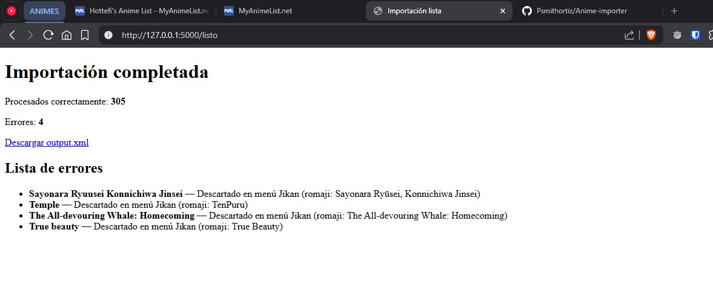
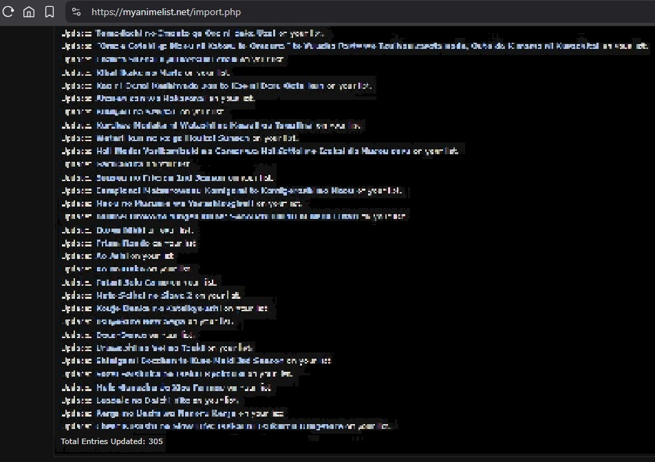

# Anime Importer

A Python tool that normalizes a messy personal anime list (with typos, mixed Spanish/English/romaji, and personal notes) and imports it into [MyAnimeList](https://myanimelist.net/) via native XML.

Two interfaces are available: a **CLI** for batch processing in the terminal, and a **Flask web UI** for interactive resolution of ambiguous titles with poster previews.

## Why this exists

I had ~300 anime titles in a Word document, written over years with inconsistent spelling, mixing languages, and personal annotations like `S1 S2`, `MANGA?`, or `Novela`. Manually re-entering them into MAL was not an option. Existing importers expected clean data; this tool handles the mess.

## Stack

- **Python 3.13**
- **Flask + Jinja2** — web UI
- **Google Gemini 2.5 Flash** with Google Search grounding — title normalization
- **[Jikan API](https://jikan.moe/)** — MyAnimeList search (unofficial mirror, better recall than MAL's official search for modern anime)
- **`thefuzz`** — fuzzy matching against search results
- **`requests`, `python-dotenv`, `tqdm`**

## Setup

```bash
git clone https://github.com/Psmithortiz/Anime-importer
cd Anime-importer
python -m venv .venv
.venv\Scripts\activate     # Windows
pip install -r requirements.txt
```

Create a `.env` file in the project root with:

```
GEMINI_API_KEY=your_key_here
MAL_CLIENT_ID=your_client_id_here
```

Place your anime list in `anime_list.txt`, one title per line. Notes like `MANGA?`, `S1 S2`, or `Novela` are ignored by the normalizer.

## Usage

### Web UI (recommended for interactive use)

```bash
python web.py
```

Open `http://127.0.0.1:5000` in your browser and click "EMPEZAR".

The app will:
1. Send your titles to Gemini in batches for romaji normalization
2. Search each romaji in Jikan
3. Show you menus only when the AI is uncertain (ambiguous titles) or the fuzzy match score is below threshold
4. Let you discard titles that don't match anything
5. Generate `output.xml` for upload to MAL and `errores.txt` for skipped titles

### CLI

```bash
python main.py
```

Same pipeline, terminal-based menus. Faster if you trust the defaults, less informative for ambiguous cases.

## Input format notes

The normalizer treats each line in `anime_list.txt` as a single anime entry.
Personal notes (`MANGA?`, `S1 S2`, `Novela`, etc.) are ignored during normalization.

**Important:** if a line refers to multiple seasons of the same franchise
(e.g., `Tate no Yuusha S1 S2 S3 S4`), only the main title will be normalized,
and the result will map to a single MAL entry — not one per season. To import
all seasons separately, either:

- Split them into multiple lines in `anime_list.txt` before running the importer
  (e.g., one line per season with its own season suffix), or
- Add the missing seasons manually to MAL after the import.

This is intentional: per-user notation for multi-season entries varies too much
(`S1 S2`, `Season 1, 2, 3`, `Temporada 2`, asterisks, circles, etc.) to handle
reliably in a single prompt, and keeping the normalizer focused on one job
(spelling normalization) keeps it predictable.

## How it works

```
anime_list.txt
    ↓
Gemini batch normalization (chunks of 20, ~13s sleep between chunks)
    ↓
For each title:
    ├─ ambiguous? → ask user (Gemini menu)
    ↓
    Jikan search by romaji
    ├─ fuzzy match score >= 95? → auto-resolve
    ├─ score < 95? → ask user (Jikan menu with poster preview)
    └─ no results? → log to errores.txt
    ↓
Export to output.xml
```

### Key design decisions

- **"Always-anime" prompt approach.** Every title in the input is something the user has personally watched, so the LLM doesn't need to classify whether it's anime — it just normalizes spelling. This eliminated persistent false negatives on post-cutoff titles.
- **Jikan over MAL's official search API.** MAL v2 search has poor recall for modern anime (2024+). Jikan is a public mirror that returns the same `mal_id` values, so the resulting XML imports cleanly.
- **State in a global module dict for the web UI.** Single-user local app; sessions and databases would be overkill. The state persists across HTTP requests via simple module-level scope.
- **Helper functions modify state and return True/False.** Routes orchestrate; helpers don't know about Flask. Clear separation between business logic and HTTP layer.
- **Shared processing module.** The chunk loop and Gemini normalization logic live in `processing.py` and are reused by both `main.py` and `web.py`, following the `(result, error)` tuple pattern from `retry.intentar()`.

## Results

The importer was run end-to-end on a real personal list of ~309 titles:



305 entries were imported successfully (98.7%). The 4 errors shown were
manual discards in the Jikan menu — titles whose romaji didn't resolve
cleanly and that I chose not to force into MAL.



After the XML upload, MAL confirmed `Total Entries Updated: 305`.

### Unexpected side benefit                                          

While reviewing Gemini's ambiguous menus, I sometimes noticed seasons
listed that I didn't know existed. Every time I checked, it turned out
the second season had been recently announced or was already airing
without my knowing. The normalizer effectively doubles as a passive
"what's the latest on this franchise?" check, since Gemini's grounding
pulls fresh info from Google Search on every batch.

## Development mode

For iterating on the web UI without burning Gemini quota, the app supports a local cache:

- Set `DEV_MODE = True` at the top of `web.py`
- The first successful Gemini run is saved to `gemini_cache.json`
- Subsequent runs of `/empezar` read from cache instead of calling Gemini

The cache file is in `.gitignore` and should not be committed.


## Rate limits

- **Gemini 2.5 Flash free tier**: 5 RPM, 20 RPD. Hence the 13s sleep between batches.
- **Jikan**: ~3 req/sec, no documented daily cap.

If you have 300+ titles, expect the initial normalization phase to take ~3-5 minutes.

## TODOs

- [ ] Refactor `web.py` into separate modules (`app.py`, `state.py`)
- [ ] Extract shared CSS into `static/styles.css`
- [ ] Use Jinja2 template inheritance for a shared base layout

## License

MIT